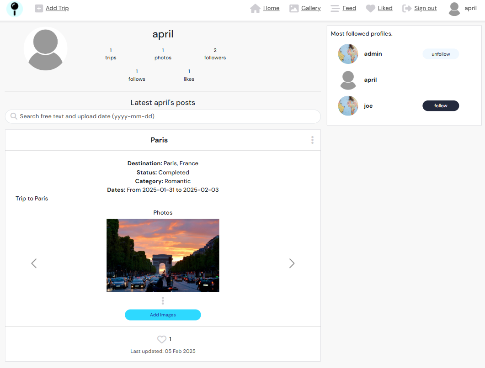
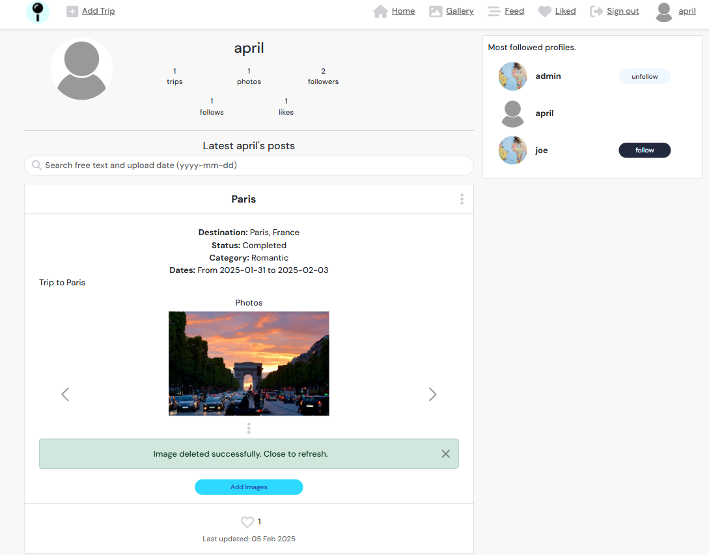
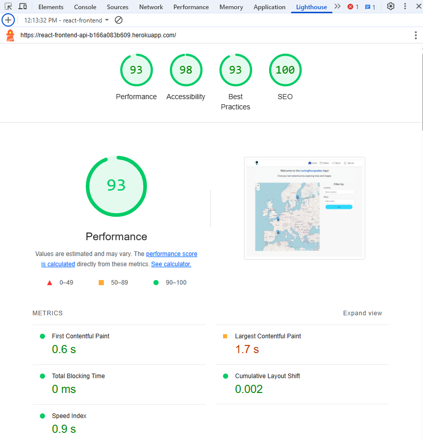

# ***<center><font color="blue"> LovinEscapades-API</font>***: The Ultimate Trip Tracking Tool!</center>
## <center> **A React - Django DRF web app** </center>

### **Table of content:**
- [Overview](#overview)
- [Installation and Setup](#installation-and-setup)
- [Application Development](#application-development)
- [Main Features](#main-features)
- [Project Structure](#project-structure)
- [State Management](#state-management)
- [API Integration](#api-integration)
- [Routing](#routing)
- [Screenshots](#screenshots)
- [Testing](#testing)
- [Heroku Deployment](#heroku-deployment)
- [Contributing](#contributing)
- [License](#license)
- [Acknowledgements](#acknowledgements)
- [Documentation version](#documentation-version)

## **Overview**
This React application serves as the frontend for the LovinEscapades project. It draws inspiration from the Moments walkthrough project by CodeInstitute and the "LovinEscapades" project from Milestone Project 4. While these earlier works laid the groundwork for core concepts and design, mandatory upgrades and refactoring were implemented to address challenges arising from the deprecation of Create React App (CRA), which was originally used in CodeInstitute's React resources. Additionally, generative AI tools, including OpenAI's GPT-4 model, were employed to debug issues caused by deprecated libraries in the CodeInstitute resources. The insights and solutions derived from this process were also applied to enhance the current project.

## **Application Development**
This application was developed using an iterative approach, following Agile principles.

#### <center> Github Kanban board with project Epics and User stories.</center>
<p align="center"></p>
<br>

#### <center> Epics and User story example.</center>
<p align="center"></p>
<br>


**User Stories & Epics**
I employed a user-centric approach, defining key epics and user stories to guide project development.

**Example Epic**:
Epic: As a frontend developer,
I want to implement robust and secure user authentication,
so that app users can securely access and interact with protected resources.

**Example User Story**:
As a new user,
I must be able to register for an account on the platform,
so that I can access all platform features.

**`Must-have` Epics and User Stories**:
* User Registration and Authentication: Implement secure and reliable user authentication.
* Core Post Functionality: Enable users to create, manage, and share trip plans and images.
* User profile and Interaction: Allow users to manage their profiles and interact with other users and their content (e.g., liking posts, following other users).

**`Could-have` Epics and User Stories**:
* USer comments and messaging: Enable users to post comments on posts and exchange messages with other users to facilitate interaction and communication within the app.

All the `must-have` user stories were implemented. The `could-have` user stories has not been implemented yet.


[*Back to top*](#)

## **Main Features**

### **Authentication**
The React application includes robust authentication features for managing user sessions.
Below are summaries of the key components responsible for authentication:

- **SignInForm.js**:
  - Handles user login by capturing username and password input.
  - Performs authentication by sending a POST request to the `/api-auth/token/` endpoint to obtain access and refresh tokens.
  - Stores the tokens in local storage and updates the current user context with fetched user information.
  - Implements error handling for login failures, providing user feedback through form validation alerts.
  - Redirects authenticated users to the home page or previous location using the `useNavigate` hook.
  - Uses custom hooks like `useSetCurrentUser` to update user state and `useRedirect` to manage redirects based on user authentication status.
  - Incorporates responsive design via Bootstrap components to ensure a cohesive user experience across devices.

- **SignUpForm.js**:
  - Facilitates new user registration through a form capturing username, password, and confirmation of password.
  - Sends a POST request to the `/dj-rest-auth/registration/` endpoint for user account creation.
  - On successful registration, navigates the user to the sign-in page to allow login.
  - Provides feedback on form submissions with detailed error alerts for validation issues such as mismatched passwords or duplicate usernames.
  - Uses the `useRedirect` custom hook to prevent access to the signup page when a user is already authenticated.
  - Employs Bootstrap components for form structuring and styling, supporting an engaging and accessible registration process.


### **Mapping and geolocation services**
* Easy navigation from the map markers and profile, add/edit trip images

### **Image gallery for site visitiors**
* Privacy (display only shared trips and images)
* Private info is available only to the user, on its profile page

### **Custom hooks**
The application incorporates custom React hooks to streamline functionality and improve user interactions:

- **useRedirect.js**:
  - This hook manages navigation based on the user's authentication status and it helps protect routes that require authentication. This is achieved by implementing a mechanism that checks if a user is logged in before allowing them to navigate to protected routes. If the user is not authenticated, they are redirected to the login page or to home page.
  - It utilizes `react-router-dom`'s `useNavigate` hook to redirect users dynamically.
  - When executed, it checks whether a user is logged in via an API request to `/dj-rest-auth/user/`.
    - If the `userAuthStatus` is "loggedIn" and the user is authenticated, the hook navigates to the homepage.
    - If the `userAuthStatus` is "loggedOut" and the user is not authenticated, it also redirects to the homepage.

- **useClickOutsideToggle.js**:
  - This utility hook is designed to manage UI elements that expand and collapse based on click events outside of a targeted component.
  - It maintains state (`expanded`) to track whether the element is expanded and uses a `ref` to reference the targeted element.
  - The hook listens for mouseup events and sets the expanded state to false if a click is detected outside the referenced element.

### **Infinite scrolling**
The application implements infinite scrolling for viewing lists of posts and images. As users scroll down, additional content is dynamically loaded, providing a seamless and uninterrupted browsing experience without the need for pagination.

### **Styling**
The application leverages the following tools and approaches for styling:
- **React Bootstrap:** The [React Bootstrap](https://react-bootstrap.github.io/) library is used to ensure a responsive and consistent design across all components.
- **CSS Modules:** Most components have their own associated CSS modules, ensuring scoped and maintainable styles. This approach prevents style conflicts and promotes modularity.
- **Font Awesome Icons:** The [Font Awesome](https://fontawesome.com/) library is integrated to provide scalable vector icons.

### **Responsive design**
The application ensures a seamless user experience across all devices using **React Bootstrap** and custom **CSS**, which provides a responsive grid system and adaptive components.
This guarantees consistent functionality and aesthetics on mobile, tablet, and desktop screens.

[*Back to top*](#)


## **Project Structure**
The `index.js` and `App.js` files are key components of the React application:

- **`index.js`**: This file is the entry point of the React application. It sets up the React application to render within the HTML root element. The application is wrapped with several key providers and routing functionality:
  - **`Router`** from `react-router-dom` is utilized to manage navigation throughout the app.
  - **`CurrentUserProvider`** and **`ProfileDataProvider`** are context providers employed to manage global state concerning user information and profile data, improving state management across different components.
  - The application is ultimately rendered with the `<App />` component encapsulating it.

[*Back to top*](#)


## **State Management**

### CurrentUserContext
- **`CurrentUserContext.js`**: Manages state and operations related to the current authenticated user.
  - Provides `CurrentUserContext` and `SetCurrentUserContext` to manage and update the user's session state.
  - Fetches user data from the server and keeps track of login status. Automatically refreshes tokens and handles logout.
  - Includes hooks `useCurrentUser` and `useSetCurrentUser` to facilitate easy access and updates to the user state in consuming components.
  - Implements a refresh mechanism that periodically refreshes the access token to maintain session validity.

### ProfileDataContext
- **`ProfileDataContext.js`**: Manages state and operations related to user profiles, particularly in follow-related interactions.
  - Provides `ProfileDataContext` and `SetProfileDataContext` for sharing profile data across components.
  - Handles the retrieval of popular profiles and manages follow/unfollow functionality through asynchronous requests.
  - Utilizes utility functions (`followHelper`, `unfollowHelper`) to update state when profiles are followed or unfollowed.
  - Offers hooks `useProfileData` and `useSetProfileData` for accessing profile data and performing actions like follow/unfollow within components.

[*Back to top*](#)

## **API Integration**
The React application interfaces with the Django API using the Axios library for HTTP requests.

### Axios Configuration
- **`axiosDefaults.js`**: This file is responsible for configuring Axios, the HTTP client used for making API requests.
  - Sets the base URL for API requests. Defaults to `http://127.0.0.1:8000` for local development.
  - Configures Axios to handle requests with `multipart/form-data` content type and to send cookies with requests (`withCredentials: true`).
  - Provides two Axios instances, `axiosReq` and `axiosRes`, with separate request and response interceptors.
  - **Request Interceptor**: Automatically attaches an access token from localStorage to the headers of outgoing requests.
  - **Response Interceptor**: Handles 401 Unauthorized errors by attempting to refresh tokens using a stored refresh token, updating the local storage and retrying the original request if successful.

## **Routing**
The application's route management is handled within `App.js` using `react-router-dom`.
It defines multiple routes for various pages in the application:

- **Home (`/`)**: Displays a `MapComponent` and a `TripFilterForm`, allowing users to apply filters to their views.
- **Gallery (`/gallery`)** and **Feed (`/feed`)**: Display images with options to filter based on user interactions like following users or liking posts.
- **Authentication Routes**: Includes paths for sign-in (`/signin`) and sign-up (`/signup`) forms.
- **Trip Management**:
  - Creation, editing, and image upload are facilitated at paths like `/trips/create`, `/trips/:tripId/edit`, and `/trips/:tripId/images`.
- **Profile Management**:
  - Profile viewing and editing are managed via routes such as `/profiles/:id`, with specific endpoints for editing username and password.
- **NotFound**: A wildcard route (`*`) is utilized to render a `NotFound` component for any undefined paths, enhancing user experience.

[*Back to top*](#)

## **Screenshots**

### **Features for Unauthenticated Site Visitors**

#### <center> **Landing page view: navbar with site logo and menus, header, Leaflet map component map search filters.**</center>
<p align="center"></p>
<br>

#### <center> **Map filters example: filter by country name.**</center>
<p align="center"></p>
<br>

#### <center> **Map filters example: filter by place/city name.**</center>
<p align="center"></p>
<br>

#### <center> **Information on popups not unavailable to unauthenticated site visitors. Login required for details**</center>
<p align="center"></p>
<br>

#### <center> **Image gallery page with search bar, image card and popoular profiles info card (login required). The image card contains the image title at the top and the image in the card body. The footer contains a short image description and a `Likes` button that allows users (not the image owner) to like/unlike the image.**</center>
<p align="center"></p>
<br>

#### <center> **Signup form: username, password and passwrod confirmation required.**</center>
<p align="center"></p>
<br>

#### <center> **Signin form: username and password required.**</center>
<p align="center"></p>
<br>

### **Features for Authenticated Users**

#### <center> **Landing page for authenticated users. Map component with active marker tooltips indicating username (with reference to trip owner's profile page), trip info and last uploaded image, and functionality for uploading images and deleting the trip.** </center>
<p align="center"></p>


#### <center> **Form for creating a new trip. All fields are mandatory. The `Shared` option is active by default, which implies that the user agrres sharing the trip info on the map component and on it's profile page**</center>
<p align="center"></p>
<br>

#### <center> **Form for creating a new trip: details on date picker, trip categoriy and trip status fields**</center>
<p align="center"></p>
<br>


#### <center> **Form for creating a new trip: Date and trip status validation example**</center>
<p align="center"></p>
<br>


#### <center> **Gallery page with search bar activated card with info on the top 10 most followed users. The `Like` icons has red background for the liked images** </center>
<p align="center"></p>
<br>

#### <center>**Feed-page displaying the images posted by the followed users, with the most recently posted image at the top**.</center>
<p align="center"></p>
<br>

#### <center> **Liked-page displaying the images that received likes**</center>
<p align="center"></p>
<br>

#### <center>**The profile displayong the owner's trip list with a free-text search bar at the top, and cards for profile statistics the most followed users**</center>
<p align="center"></p>
<br>

#### <center>**Clicking on a carousel image opens a modal that displays detailed information about the image**</center>
<p align="center"></p>
<br>

#### <center> **Clicking on the vertical three-dot icon in the trip card header opens the edit/delete trip options.**</center>
<p align="center"></p>
<br>

#### <center> **Edit/delete trip forms details. The trip edit form is pre-filled with the trip info. Clicking the `Delete` button opens an alert to confirm/cancel the action.**</center>
<p align="center"></p>

#### <center> **Clicking on the vertical three-dot icon underneath the carousel images opens the edit/delete image options.**.</center>
<p align="center"></p>
<br>

#### <center> **The edit image is pre-filled with the image info.**</center>
<p align="center"></p>
<br>

#### <center> **Delete image forms details: Clicking the `Delete` button opens an alert to confirm/cancel the action.**</center>
<p align="center"></p>
<br>

#### <center> **A success alert is shown once the deletion is successfully completed, and the page refreshes automatically after the user closes the alert.**</center>
<p align="center"></p>
<br>

#### <center> **Clicking on the three-dots vertcal menu on the right side of the profile page opend the profile edit menu containing the `edit profile`, `change username`, `change password` and `delete profile` options**</center>
<p align="center"></p>
<br>

#### <center> **Edit profile details: `edit profile`, `change username`, and `change password` forms**</center>
<p align="center"></p>
<br>


#### <center> **Selecting the `Delete profile` option opens an alert to confirm/cancel the action. After successful deletion, the user is redirected to the `Login` page**</center>
<p align="center"></p>
<br>


[*Back to top*](#)


## Testing

### Manual testing

Manual testing was conducted to ensure all user-facing features function properly across different user scenarios.
Each feature was tested systematically following these steps:

1. **Test Preparation**: Setting up test conditions (logged in/out states)
2. **Test Execution**: Performing the actions as an end user would
3. **Result Verification**: Confirming expected outcomes
4. **Edge Case Testing**: Testing form validations and error handling


#### Authentication Tests (✅ Pass)

| Test Case | Steps | Expected Result | Status |
|-----------|-------|-----------------|--------|
| User Registration | 1. Navigate to signup page<br>2. Enter username<br>3. Enter password<br>4. Confirm password<br>5. Submit form | 1. Form submits successfully<br>2. Redirect to login page<br>3. Success notification appears | ✅ Pass |
| User Login | 1. Navigate to login page<br>2. Enter valid credentials<br>3. Submit form | 1. Form submits successfully<br>2. Redirect to home page<br>3. Navbar updates with user options<br>4. Welcome message with user name is displayed | ✅ Pass |
| Login Validation | 1. Submit login form with empty fields<br>2. Submit with incorrect password | 1. Form validation errors display<br>2. Appropriate error message shown | ✅ Pass |
| User Logout | 1. Click logout in navbar when logged in | 1. Session ends<br>2. Redirect to home page<br>3. Navbar updates to remove user options | ✅ Pass |

#### Profile Management Tests (✅ Pass)

| Test Case | Steps | Expected Result | Status |
|-----------|-------|-----------------|--------|
| View Profile | 1. Click on profile in navbar<br>2. Navigate to another user's profile | 1. Profile page loads with correct user data<br>2. Trips and images display according to sharing permissions | ✅ Pass |
| Edit Profile | 1. Navigate to own profile<br>2. Click edit profile<br>3. Update bio and image<br>4. Submit changes | 1. Changes save successfully<br>2. Profile page reflects updates<br>3. Success notification appears | ✅ Pass |
| Change Username | 1. Access username change form<br>2. Enter new username<br>3. Submit changes | 1. Username updates across the app<br>2. User is logged out and redirected to Home page | ✅ Pass |
| Change Password | 1. Access password change form<br>2. Enter current password<br>3. Enter new password twice<br>4. Submit changes | 1. Password updates successfully<br>2. Success notification appears<br>3. User is logged out and redirected to Home page | ✅ Pass |
| Delete Profile | 1. Access delete profile option<br>2. Confirm deletion in modal | 1. Profile and associated data deleted<br>2. User logged out<br>3. Redirect to home page | ✅ Pass |

#### Trip Management Tests (✅ Pass)

| Test Case | Steps | Expected Result | Status |
|-----------|-------|-----------------|--------|
| Create Trip | 1. Click "Add Trip" button<br>2. Complete all required fields<br>3. Submit form | 1. Trip creates successfully<br>2. Appears on map and profile<br>3. Redirect to profile page. | ✅ Pass |
| Form Validation | 1. Submit trip form with missing fields<br>2. Enter invalid/inconsistent data | 1. Form validation errors display<br>2. Form prevents submission until fixed | ✅ Pass |
| Edit Trip | 1. Navigate to trip from map/profile<br>2. Click edit option<br>3. Modify fields<br>4. Submit changes | 1. Form pre-fills with existing data<br>2. Changes save successfully<br>3. Map and profile update | ✅ Pass |
| Delete Trip | 1. Access trip delete option<br>2. Confirm deletion in modal | 1. Trip and associated images removed<br>2. Map and profile update<br>3. Success notification appears | ✅ Pass |
| Privacy Control | 1. Create trip with "Shared" unchecked<br>2. View as different user | 1. Trip visible only to owner<br>2. Hidden from other users on map and gallery | ✅ Pass |

#### Image Management Tests (✅ Pass)

| Test Case | Steps | Expected Result | Status |
|-----------|-------|-----------------|--------|
| Upload Image | 1. Navigate to trip<br>2. Click "Add Image"<br>3. Select image file<br>4. Complete form fields<br>5. Submit | 1. Image uploads successfully<br>2. Appears in trip carousel<br>3. Success notification appears | ✅ Pass |
| Edit Image | 1. Access image edit option<br>2. Modify title/description<br>3. Submit changes | 1. Form pre-fills with existing data<br>2. Changes save successfully<br>3. UI updates to reflect changes | ✅ Pass |
| Delete Image | 1. Access image delete option<br>2. Confirm deletion in modal | 1. Image removed from trip and gallery<br>2. UI updates<br>3. Success notification appears | ✅ Pass |
| Like/Unlike Image | 1. View image in gallery<br>2. Click like button<br>3. Click again to unlike | 1. Like count increases/decreases<br>2. Button style changes<br>3. Image appears/disappears from Liked page | ✅ Pass |

#### Map and Navigation Tests (✅ Pass)

| Test Case | Steps | Expected Result | Status |
|-----------|-------|-----------------|--------|
| Map Markers | 1. Navigate to home page<br>2. Check marker visibility<br>3. Click on markers | 1. Markers appear for shared trips<br>2. Pop-up displays correct trip info<br>3. Links to profiles work correctly | ✅ Pass |
| Map Filters | 1. Use country filter<br>2. Use place/city filter | 1. Map updates to show only matching trips<br>2. Filters apply correctly based on criteria | ✅ Pass |
| Responsive Layout | 1. Test on desktop, tablet, mobile<br>2. Resize browser window | 1. UI adapts to different screen sizes<br>2. Components reflow appropriately<br>3. Map controls remain usable | ✅ Pass |

#### Gallery and Feed Tests (✅ Pass)

| Test Case | Steps | Expected Result | Status |
|-----------|-------|-----------------|--------|
| Gallery View | 1. Navigate to gallery page<br>2. Scroll through images | 1. Shared images display <br>2. Infinite scroll loads more images | ✅ Pass |
| Feed View | 1. Follow users<br>2. Navigate to feed page | 1. Only images from followed users appear<br>2. Images sort by recency | ✅ Pass |
| Liked Images | 1. Like various images<br>2. Navigate to liked page | 1. Only liked images appear<br>2. Unliking removes from this view | ✅ Pass |
| Search Function | 1. Enter search terms in gallery/profile | 1. Results filter correctly<br>2. No results message appears when appropriate | ✅ Pass |


### Validators

#### Lighthouse
The Lighthouse validator, configured for desktop applications, was used to evaluate the app's overall performance. The lowest score of 90 for Performance was primarily due to the load delay of the Leaflet tile.

#### <center> **Lighthouse validator: Home page (unauth users)**</center>
<p align="center"></p>

<br>

#### <center> **Lighthouse validator: Gallery page (authenticated users)**</center>
<p align="center"></p>
<br>

Nearly similar reesults were obtaied for the `Feed` and `Liked`-pages.

[*Back to top*](#)

## Heroku Deployment
Server instructions for Heroku deployment are included in the [`Procfile`](Procfile) file.
The base URL for the backend API is specified in the [`axiosDefaults.js`](src\api\axiosDefaults.js).

During deployment, the Heroku platform issued warnings due to the use of the deprecated Create React App (CRA) build, particularly when using the Heroku-20 stack. Despite these warnings, the Heroku-20 stack was the only one capable of successfully supporting the app's deployment.

#### <center> **Heroku platform warning against using the Heroku-20 stack**</center>
<p align="center"></p>
<br>

### Known Bugs
The application generates console warnings when loading images over http to Cloudinary, as it prefers secure https connections for improved security and compatibility.
<p align="center"></p>
<br>

[*Back to top*](#)


## Installation
To get the app up and running on your local machine for development and testing purposes, follow these steps:

* **Prerequisites**
Ensure you have the following tools installed on your development machine:
- **Node.js**: [Download and install Node.js](https://nodejs.org/), which comes with `npm`.
- **Git**: [Download and install Git](https://git-scm.com/).

* **Clone Repository**
First, clone the repository to your local machine using Git. Open your terminal and run:
```bash
git clone https://github.com/eneliviu/react-frontend-api.git
```

* **Install Dependencies**
Once inside the project directory, install the necessary `npm` packages:
```bash
npm install
```
This will install all dependencies listed in the `package.json` file.

* **Running the Application**
You can run the application in development mode with the following command:
```bash
npm start
```
This will start the development server and open the app in your default web browser. If not, you can visit it at [http://localhost:3000](http://localhost:3000).

### Contribution Guide
#### Fork the Project
* Click the "Fork" button on the top-right corner of the repository page
* Clone Your Fork by running the following command in the terminal or command prompt:
```bash
git clone https://github.com/eneliviu/react-frontend-api.git
```
* Make and commit your changes with clear messages, for example:
```bash
git add .
git commit -m "Fix issue #123: Corrected the layout on the homepage"
```
* Push your commits to your forked repository on GitHub.
```bash
git push
```

* Submit a pull request detailing your changes and their benefits.

[*Back to top*](#)

## License
### Open Source
As an open-source project, ***LovinEscapades-API*** promotes transparency and community involvement.
The code is accessible on GitHub, allowing developers to view, fork, and contribute to the project as they desire.

[*Back to top*](#)

## Acknowledgements
I would like to extend my gratitude to my mentor, Luke Buchanan, for his support and patience, especially during the challenging initial stages of the frontend development.

[*Back to top*](#)

## Documentation version

Last updated: March 22, 2025

[*Back to top*](#)